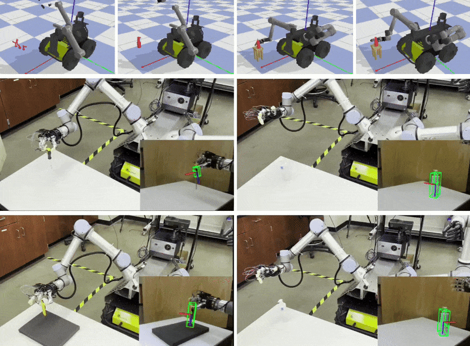

## DexMobile: 40-DoF Bimanual Mobile Manipulation System

**Real-world grasp demo** (83% success, 500+ trials)


**120 Hz real-time control on Jetson AGX Orin** (~0.6 ms inference)


**Sim-to-real transfer pipeline** (88% transfer rate)

## Open Source

- [ROS 2 driver for Psyonic Ability Hand (125 Hz tactile streaming)](https://github.com/Marsenrage/psyonic_ros2_control) — adopted by external labs and recognized by the vendor
